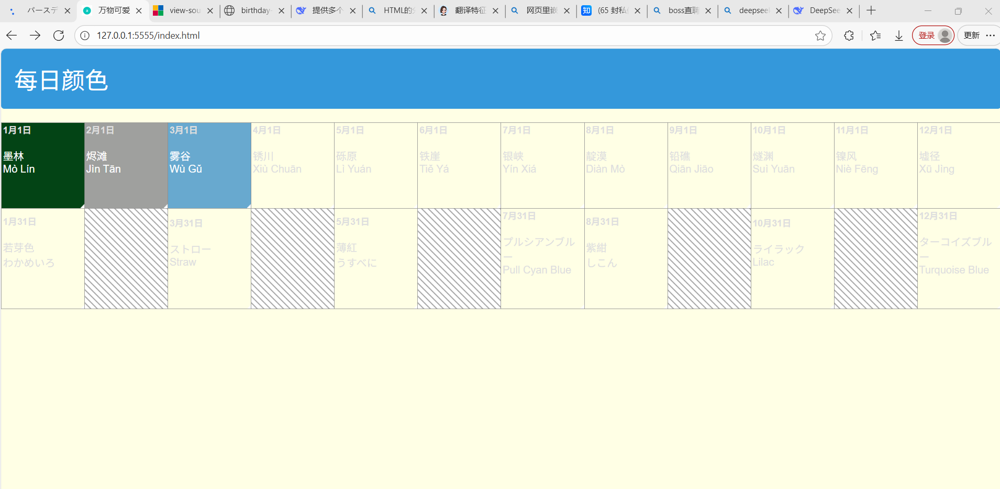
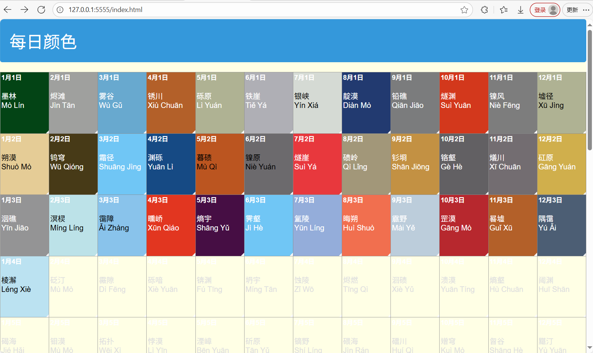

这是一个纯前端的练手网站

参考网站：[バースデーカラー　自分の誕生色を知ってラッキーカラーにしましょう](http://birthday-color.cafein.jp/index.html)

其实想做出来的效果图是这个样子的 [淡密黄 - 中国色 - 中国传统颜色](https://hag.cc/#danmihuang)

但奈何能力有限 （以后再做做试试看吧）

一些进度图

就到这里吧，感觉我已经完全掌握它的技巧了(...)

剩下的不想做了感觉也没啥意义了

然后想办法先提交到github上吧

在提交的过程中遇到了一个小问题：

> nothing to commit, working tree clean

据说是要随便改点啥再提交

所以写了这个readme

以上。